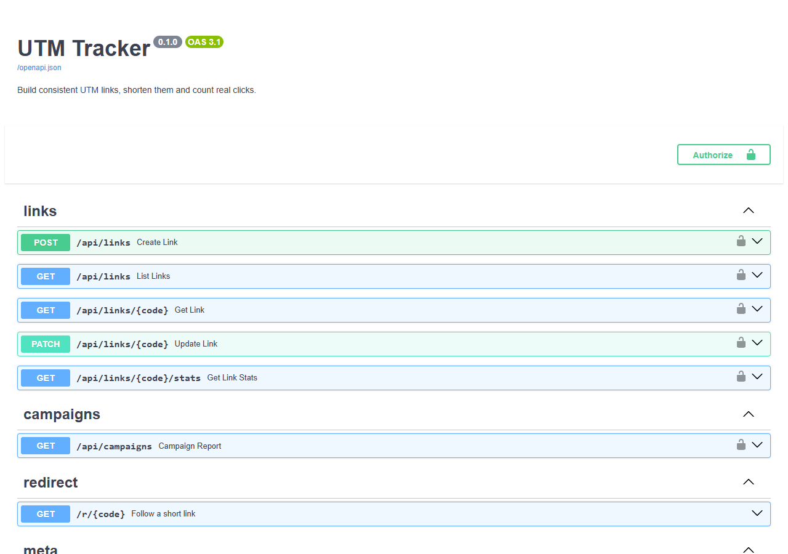

# UTM Tracker

A small service for marketing links: it builds consistent UTM-tagged URLs, shortens them, and counts the clicks that came from people rather than machines.

Built with **FastAPI**, **SQLAlchemy 2**, **Alembic** and **PostgreSQL** (SQLite works for local use), packaged with **Docker Compose**.



## Why it exists

Campaign reports go wrong in two quiet ways:

1. **Inconsistent tags.** `Facebook`, `facebook` and `facebook ` are three different sources to an analytics tool, so one channel ends up spread over three report rows. The tracker lowercases and hyphenates every value, rejects characters that don't belong, and returns a warning for each change so the person creating the link sees what happened.
2. **Clicks that aren't people.** Corporate email gateways (Proofpoint, Mimecast, Barracuda and others) open every link in an incoming email to scan it, seconds after delivery, before anyone reads it. Link previews in Slack, WhatsApp and LinkedIn do the same. The tracker records those hits separately as `bot_clicks` and leaves them out of the numbers you report on.

## What it does

- `POST /api/links` builds the tagged URL, keeps the destination's own query parameters and `#fragment`, replaces any UTM tags already on it (with a warning), and returns a short link like `/r/autumn`.
- `GET /r/{code}` redirects immediately and records the click in a background task, after the response has gone out, so visitors never wait on the database. It answers with a `302` and `Cache-Control: no-store`, because a `301` would be cached by the browser and later clicks would never reach the server. Archived links answer `410 Gone`, and their history is kept.
- `GET /api/links/{code}/stats` returns clicks and unique visitors per day (days with no clicks included as zeros), devices, top referrers and filtered bot clicks.
- `GET /api/campaigns` returns clicks per campaign, source and medium: the table a campaign report starts from.

### Unique visitors without storing IP addresses

Each click stores `sha256(secret | date | ip | user agent)` and never the IP itself. The date is part of the hash, so the same person produces a different value tomorrow and visits can't be linked across days. Privacy-focused analytics tools use the same approach. The trade-off is that `unique_visitors` over a period is the sum of daily uniques: someone who clicks on two different days counts twice.

### Workspaces and API keys

Management endpoints need an `X-API-Key` header. Each key only sees the links it created; someone else's link answers `404`, the same as a link that doesn't exist. Keys are random 256-bit tokens stored as SHA-256 hashes. That's enough for tokens this long; passwords would need a slow hash. Keys are shown once, at creation.

```bash
utm-tracker create-key "Marketing team"
utm-tracker list-keys
utm-tracker revoke-key utm_AbCdEfGh
```

## Running it

With Docker:

```bash
docker compose up -d --build
docker compose exec api utm-tracker create-key "Marketing"
```

Or locally with [uv](https://docs.astral.sh/uv/) and SQLite:

```bash
uv sync
uv run alembic upgrade head
uv run utm-tracker create-key "Marketing"
uv run uvicorn utm_tracker.main:app --reload
```

The interactive docs are at http://localhost:8000/docs. A full round trip:

```bash
curl -X POST localhost:8000/api/links -H "X-API-Key: $KEY" -H 'content-type: application/json' -d '{
  "destination_url": "https://shop.example.com/autumn?ref=nav#top",
  "utm_source": "Newsletter", "utm_medium": "email", "utm_campaign": "Autumn Sale 2026",
  "code": "autumn"
}'
```

```json
{
  "code": "autumn",
  "short_url": "http://localhost:8000/r/autumn",
  "tagged_url": "https://shop.example.com/autumn?ref=nav&utm_source=newsletter&utm_medium=email&utm_campaign=autumn-sale-2026#top",
  "warnings": [
    "utm_source \"Newsletter\" was changed to \"newsletter\".",
    "utm_campaign \"Autumn Sale 2026\" was changed to \"autumn-sale-2026\"."
  ],
  "clicks": 0
}
```

(Trimmed.) Settings come from environment variables: `UTM_DATABASE_URL`, `UTM_BASE_URL` (used for `short_url`) and `UTM_VISITOR_SECRET`.

## Development

```bash
uv run pytest          # tests, SQLite in memory
uv run ruff check . && uv run ruff format --check .
uv run mypy            # strict mode
```

CI runs the test suite twice, on SQLite and on PostgreSQL (`TEST_DATABASE_URL`), because the two accept different SQL. The migration test runs `upgrade head` and `downgrade base` and checks that the resulting schema matches the models. The last CI job builds the image, starts the Compose stack and pushes a link through create → redirect → stats.

## Layout

```
src/utm_tracker/
  utm.py        tag building and normalization (pure functions)
  visitors.py   device and bot detection, referrers, visitor hash
  clicks.py     recording clicks, per-link statistics
  routers/      links + campaigns API, the /r/ redirect
  security.py   API keys
  cli.py        key management
alembic/        migrations
```
